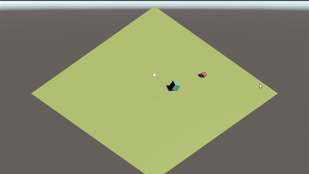
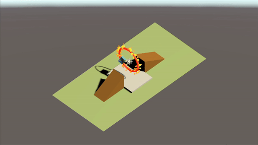
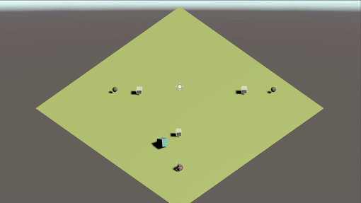
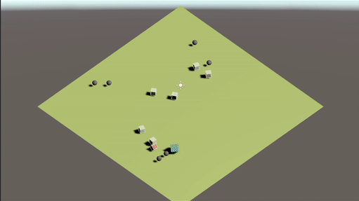

# RL_Cube. 

*I am a Smart Cube.*

* using Unity_ML Agents
* using simple NN model and PPO optimizer
## Preivew

### 1 Simple Cube.

**1.0 Target Tracking**
 

**1.1 Fire hoop**

### 2 Cube with Sensor

**2.0 Target Tracking**

**2.1 Obstacle**

**2.2 More Obstacle**

**2.3 SmartCubes(RainBall)**

### 3 AirCube

**3.0 Target Tracking**

**3.1 AirCubes**

**3.2 Volleyball**

